# Breezly — Coupled 72-Hour Delhi NCR AQI Forecasting System

Breezly is a high-resolution air quality forecasting prototype specifically designed for the Delhi National Capital Region (NCR) that models the complex, two-way coupling between atmospheric boundary layer meteorology and surface air pollution. Rather than treating numerical weather prediction and pollutant dispersion as uncoupled independent streams, Breezly implements a 72-hour recursive forecasting pipeline that explicitly captures atmospheric ventilation and trapping, regional biomass-burning (stubble) plume dispersion, empirical photochemical ground-level ozone ($O_3$) kinetics, and the self-amplifying feedback loop where high aerosol loading suppresses boundary layer mixing and solar radiation.

---

## Problem Statement

Traditional air quality index (AQI) forecasting models frequently suffer from key structural limitations:
- **Uncoupled Modeling**: Meteorology and pollution are often treated as one-way independent systems, ignoring the physical reality that high aerosol concentrations alter surface energy balance and boundary layer dynamics.
- **Atmospheric Stagnation & Trapping**: Delhi NCR experiences severe seasonal pollution episodes where shallow nocturnal boundary layer heights and calm surface winds severely restrict atmospheric dilution volume, trapping primary urban emissions near the ground.
- **Aerosol-Radiation-Boundary Layer Feedback**: High aerosol optical loading scatters and absorbs incoming shortwave solar radiation, cooling the surface and further suppressing daytime convective Planetary Boundary Layer (PBL) development, creating a positive feedback loop that intensifies winter smog.
- **Regional Episodic Events**: Post-monsoon agricultural crop residue (stubble) burning in neighboring states (Punjab and Haryana) injects massive smoke plumes that advect into the Delhi NCR airshed under prevailing northwesterly wind corridors.
- **The Objective**: Build a functional, high-resolution 72-hour coupled forecasting prototype for Delhi NCR that models these physical mechanisms and provides actionable explanations without overclaiming production-scale chemical transport simulations.

---

## Our Approach

Breezly implements an end-to-end, stepwise **Physics-Informed Parametric Surrogate Forecasting Engine** coupled with a modern interactive visualization dashboard:

```
[NWP 72h Meteorology (Open-Meteo GFS/ECMWF)] + [Regional Biomass Fire Hotspots (Punjab/Haryana)]
                                      │
                                      ▼
             [Atmospheric Ventilation & Nocturnal Trapping Proxy]
                                      │
                                      ▼
             [2D Kinematic Stubble Plume Advection & Risk Index]
                                      │
                                      ▼
      [Stepwise Coupled PM2.5 Eulerian Box Model & Empirical O3 Surrogate]
                                      │
                                      ▼
         [Two-Way Aerosol-Radiation-PBL Height Feedback Loop (t → t+1)]
                                      │
                                      ▼
                     [Indian National AQI Sub-Index Engine]
                                      │
                                      ▼
            [Interactive 72-Hour React Dashboard & Diagnostic UI]
```

> **Important Scientific Scope Note**: Breezly is a proof-of-concept **parametric surrogate** engine. It does not run a full Eulerian photochemical grid model (such as WRF-Chem or CMAQ) requiring multi-node HPC clusters, but instead solves dimensionally consistent box-model recurrence equations parameterized by atmospheric physics and empirical Indo-Gangetic Plain smog research.

---

## Key Features

- **72-Hour Stepwise Recursive Forecasting**: Step-by-step recurrence where pollutant states at hour $t$ dynamically influence effective meteorology and concentrations at hour $t+1$.
- **Delhi NCR Multi-Station Network**: Multi-node spatial coverage across 10 key CPCB monitoring stations (Anand Vihar, Punjabi Bagh, Dwarka, IGI Airport, RK Puram, Lodhi Road, Noida Sec 62, Gurugram Vikas Sadan, Ghaziabad Vasundhara, Faridabad Sec 16A).
- **Physical PM2.5 Mass-Balance Model**: Dimensionally consistent Eulerian atmospheric column mass balance accounting for local primary emissions, regional stubble smoke inflow, dry deposition, and horizontal advection clearance.
- **Empirical Photochemical Ground-Level Ozone ($O_3$) Surrogate**: Captures solar radiation-driven daytime photolysis, temperature activation, $NO_x$ precursor dependency, nocturnal $NO$ titration loss, and boundary layer dilution.
- **Ventilation Index & Atmospheric Trapping Proxy**: Computes horizontal and vertical dilution capacity ($VI = \text{PBLH} \times \text{WindSpeed}$) and normalized trapping potential scores ($0-100$).
- **Regional Biomass-Burning Plume Transport Model**: 2D kinematic advection model using active fire coordinates, Fire Radiative Power (FRP), wind alignment vectors, Gaussian angular dispersion, and transit time decay to output a normalized **Plume Impact Index ($0-100$)**.
- **Two-Way Aerosol-Radiation-PBL Feedback Surrogate**: Parameterized shortwave solar radiation attenuation ($\exp(-0.0012 \cdot \text{PM}_{2.5})$) and boundary layer height suppression (up to $35\%$) driven by predicted aerosol optical loading.
- **Coupled vs. Uncoupled Comparative Diagnostics**: Evaluates parallel trajectories to quantify the exact amplification of PM2.5 and suppression of PBL height caused by the feedback loop.
- **CPCB Indian National AQI (INAQI) Standard**: Piecewise linear sub-index calculation and color-coded categorization (Good to Severe).
- **Model-Derived Source Attribution & Causal Explanations**: Automated qualitative impact decomposition (`Biomass Plume Impact`, `Atmospheric Trapping`, `Local Urban Load`) with plain-language causal reasoning.
- **Interactive 72-Hour Scrubber Dashboard**: Scrub, pause, and auto-play hour-by-hour forecast timelines with live meteorological telemetry.
- **Spatial Geospatial Map**: Leaflet-powered map rendering dynamic station pins with AQI values, active Punjab/Haryana fire pins, and popup analytics.
- **Strict Data Provenance Badges**: Every visual element explicitly displays its data origin: `[LIVE NWP]`, `[CACHED DATA]`, `[PROTOTYPE/DERIVED]`, and `[72H FORECAST]`.

---

## Scientific Methodology

### 1. Meteorological Inputs
- **Live Source**: Open-Meteo NWP Forecast API (`https://api.open-meteo.com/v1/forecast`), requesting 72-hour hourly GFS/ECMWF blends.
- **Variables Ingested**:
  - $T_{2m}$: 2-meter air temperature (°C)
  - $RH_{2m}$: Relative humidity (%)
  - $WS_{10m}$, $WD_{10m}$: 10-meter wind speed (m/s) and meteorological wind direction (°)
  - $PBLH_{\text{nwp}}$: Planetary Boundary Layer Height (m)
  - $I_{\text{nwp}}$: Downward shortwave surface solar radiation (W/m²)
  - $P_{\text{sfc}}$: Surface atmospheric pressure (hPa)
- **Fallback Behavior**: If network requests fail, a physics-consistent synthetic diurnal series (`generate_synthetic_nwp_series`) is generated, preserving characteristic Delhi winter diurnal cycles and labeled as `CACHED DATA`.

---

### 2. Atmospheric Trapping & Ventilation
Dilution volume capacity is calculated directly from boundary layer height and horizontal wind speed:
$$\text{Ventilation Index } (VI) = \text{PBLH}_{\text{coupled}} \times \text{WindSpeed} \quad (\text{m}^2/\text{s})$$

The normalized **Trapping Potential Score** ($0-100$) is computed via a non-linear sigmoidal response with a critical threshold at $VI = 1800\text{ m}^2/\text{s}$:
$$\text{TrappingScore} = \frac{100.0}{1.0 + \exp(0.0018 \cdot (VI - 1800.0))} + \text{NocturnalBoost}$$

Where $\text{NocturnalBoost} = 15.0 \times \left(1.0 - \min\left(1.0, \frac{\text{PBLH}_{\text{coupled}}}{400.0}\right)\right)$ when solar radiation $< 10\text{ W/m}^2$.

> **Disclaimer**: This is a **Ventilation & Atmospheric Trapping Proxy** representing atmospheric mixing volume. It is not a direct vertical temperature sounding measurement.

---

### 3. Biomass-Burning Plume Advection & Risk Model
Regional stubble burning plumes from Punjab and Haryana are modeled through kinematic forward transport:
1. **Source Geometries**: Ingests active fire coordinates $(lat_i, lon_i)$ and Fire Radiative Power ($\text{FRP}_i$, MW).
2. **Trajectory Alignment**: Computes angular difference $\Delta \theta_i$ between downwind vector $\theta_{\text{downwind}} = (\text{WindDir} + 180^\circ) \bmod 360^\circ$ and compass bearing to Delhi $\theta_{\text{bearing}, i}$.
3. **Gaussian Dispersion Envelope**:
   $$\text{angular\_factor}_i = \exp\left(-\frac{\Delta \theta_i^2}{2 \sigma_\theta^2}\right) \quad (\sigma_\theta = 0.45\text{ rad})$$
4. **Transit Time & Distance Attenuation**:
   $$\tau_i = \frac{d_i}{\max(3.0, \text{WindSpeed} \times 3.6)} \text{ hours}$$
   $$\text{flux}_i(t) = \left(\frac{\text{FRP}_i}{100.0}\right) \cdot \text{angular\_factor}_i \cdot \left(\frac{1.0}{1.0 + 0.03 \tau_i}\right) \cdot \left(\frac{1.0}{\sqrt{d_i / 100.0}}\right)$$
5. **Airshed Accumulation & Normalization**:
   $$\text{PlumeMemoryFlux}(t) = 0.75 \cdot \text{PlumeMemoryFlux}(t-1) + 0.25 \sum_i \text{flux}_i(t)$$
   $$\text{Plume Impact Index} = \min\left(100.0, \max(0.0, \text{PlumeMemoryFlux} \times 28.0)\right)$$

> **Disclaimer**: The output is a **Plume Impact Index ($0-100$)** and qualitative category (`LOW`, `MODERATE`, `HIGH`, `CRITICAL`), not an exact chemical emission inventory.

---

### 4. PM2.5 Forecasting (Eulerian Atmospheric Column Model)
PM2.5 concentration at step $t+1$ is solved using a dimensionally consistent box-model difference equation across a mixed atmospheric column of height $H_{\text{eff}}(t) = \text{PBLH}_{\text{coupled}}(t)$:

$$\text{PM}_{2.5}(t+1) = \text{PM}_{2.5}(t) + \Delta C_{\text{local}}(t) + \Delta C_{\text{plume}}(t) - k_{\text{loss}}(t) \cdot (\text{PM}_{2.5}(t) - C_{\text{bg}})$$

1. **Local Primary Emission Influx**:
   $$\Delta C_{\text{local}}(t) = \left(\frac{E_{\text{urban}}(t) \times 1000\ \mu g/\text{mg}}{H_{\text{eff}}(t)\ \text{m}}\right) \cdot (1.0 + 0.80 \cdot \text{TrappingFactor}(t)) \quad \left[\frac{\mu g}{\text{m}^3 \cdot \text{h}}\right]$$
   Where $E_{\text{urban}} = 1.40\ \text{mg}/(\text{m}^2 \cdot \text{h}) \times \text{traffic\_weight} \times \text{rush\_hour\_mult}$.
2. **Regional Stubble Plume Influx**:
   $$\Delta C_{\text{plume}}(t) = (\text{PlumeIndex}(t) \cdot 0.22) \cdot \left(\frac{300\text{ m}}{H_{\text{eff}}(t)}\right) \cdot (1.0 + 0.40 \cdot \text{TrappingFactor}(t)) \quad \left[\frac{\mu g}{\text{m}^3 \cdot \text{h}}\right]$$
3. **Horizontal Ventilation & Deposition Loss Rate**:
   $$k_{\text{loss}}(t) = \min\left(0.40, \max\left(0.05, \frac{\text{WindSpeed}(t) \times 3600\text{ s}}{L_{\text{airshed}}} + 0.02\right)\right) \quad [\text{h}^{-1}]$$
   Where $L_{\text{airshed}} = 42,000\text{ m}$ (Delhi airshed scale) and $0.02\ \text{h}^{-1}$ is dry deposition.
4. **Clean Regional Background**: $C_{\text{bg}} = 25.0\ \mu g/\text{m}^3$.

---

### 5. Ground-Level Ozone ($O_3$) Photochemical Surrogate
Ground-level ozone is estimated via an empirical surrogate capturing daytime photolysis and nocturnal titration:
1. **Photochemical Formation** (Active when $I_{\text{eff}} > 20\text{ W/m}^2$):
   $$\text{PhotoFormation} = 28.0 \cdot \left(\frac{I_{\text{eff}}}{600.0}\right)^{0.85} \cdot \max(0.5, 1.0 + 0.04(T_{2m} - 22.0)) \cdot \left(\frac{\text{NO}_x/40.0}{1.0 + (\text{NO}_x/80.0)^2}\right)$$
2. **Nocturnal Titration Destruction** (When $I_{\text{eff}} \le 20\text{ W/m}^2$):
   $$\text{TitrationLoss} = \left(\frac{\text{NO}_x}{35.0}\right) \cdot \left(\frac{12.0}{1.0 + 0.005 \cdot H_{\text{eff}}}\right)$$
3. **Persistence & Convective Dilution**:
   $$O_3^*(t+1) = 0.72 \cdot O_3(t) + 0.28 \cdot (18.0 + \text{PhotoFormation}) - \text{TitrationLoss}$$
   $$O_3(t+1) = O_3^*(t+1) \cdot \left[1.0 - \min\left(0.20, \max\left(0.0, \frac{H_{\text{eff}} - 500.0}{4000.0}\right)\right)\right]$$

> **Disclaimer**: This is an **Empirical Photochemical Surrogate**, not a full chemical kinetic mechanism (such as RACM or CB05).

---

### 6. Two-Way Aerosol-Radiation-PBL Feedback Loop
At each forecast step $t$, the predicted aerosol loading feeds back to modify meteorology for step $t$:
1. **Aerosol Loading Assessment**:
   $$\text{loading\_ratio} = \min\left(2.5, \frac{\text{PM}_{2.5}(t)}{300.0\ \mu g/\text{m}^3}\right)$$
2. **Boundary Layer Height Suppression**:
   $$\text{suppression\_fraction} = 0.35 \cdot \left(\frac{\text{loading\_ratio}}{1.0 + \text{loading\_ratio}}\right)$$
   $$\text{PBLH}_{\text{coupled}}(t) = \max\left(80.0, \text{PBLH}_{\text{nwp}}(t) \cdot (1.0 - \text{suppression\_fraction})\right)$$
3. **Shortwave Solar Radiation Attenuation**:
   $$I_{\text{eff}}(t) = I_{\text{nwp}}(t) \cdot \exp(-0.0012 \cdot \text{PM}_{2.5}(t))$$

---

### 7. Indian National AQI (INAQI) Computation
Calculated using the official Central Pollution Control Board (CPCB) piecewise linear interpolation formula:
$$I_p = \left[\frac{I_{\text{hi}} - I_{\text{low}}}{\text{BP}_{\text{hi}} - \text{BP}_{\text{low}}}\right] \cdot (C_p - \text{BP}_{\text{low}}) + I_{\text{low}}$$
$$\text{Overall AQI}(t) = \max\left(\text{SubAQI}_{\text{PM2.5}}(t), \text{SubAQI}_{\text{O3}}(t)\right)$$

Breakpoints used:
- **PM2.5** ($\mu g/\text{m}^3$): 0–30 (Good, 0–50), 31–60 (Satisfactory, 51–100), 61–90 (Moderate, 101–200), 91–120 (Poor, 201–300), 121–250 (Very Poor, 301–400), 250+ (Severe, 401–500).
- **O3** ($\mu g/\text{m}^3$): 0–50 (Good), 51–100 (Satisfactory), 101–168 (Moderate), 169–208 (Poor), 209–748 (Very Poor), 748+ (Severe).

---

## Data Sources & Provenance

| Data Domain | Source / Provider | Operational Status | Usage in System |
|---|---|---|---|
| **72-Hour Meteorology** | Open-Meteo API (GFS/ECMWF blend) | `LIVE NWP` (with `CACHED` fallback) | Supplies hourly $T_{2m}, RH_{2m}, WS_{10m}, WD_{10m}, \text{PBLH}, \text{SolarRad}$ |
| **Biomass Fire Hotspots** | NASA FIRMS VIIRS/MODIS (Calibrated Dataset) | `CACHED / CALIBRATED` | 12 Punjab & Haryana fire clusters with GPS & FRP values (58–146 MW) |
| **Station Baseline Profiles** | CPCB Delhi NCR Network Metadata | `PROTOTYPE/DERIVED` | 10 monitoring station coordinates, baseline emissions, and traffic weights |
| **Plume Dispersion Engine** | Kinematic Advection & Gaussian Decay | `PROTOTYPE/DERIVED` | Computes forward wind transport alignment and Plume Impact Index ($0-100$) |
| **Two-Way Feedback Engine**| Parameterized Radiative Extinction & PBL Suppression | `PROTOTYPE/DERIVED` | Stepwise recurrence modifying effective mixing height and surface insolation |
| **Photochemical Surrogate** | Empirical Photolysis & Titration Kinetics | `PROTOTYPE/DERIVED` | Computes daytime ozone formation and nocturnal $NO_x$ destruction |

---

## System Architecture

```mermaid
flowchart TD
    subgraph Data_Services ["Data Ingestion Services (Backend)"]
        NWP["Open-Meteo 72h Met Service<br/><code>[LIVE NWP / CACHED]</code>"]
        FIRMS["NASA FIRMS Satellite Hotspots<br/><code>[CACHED DATA]</code>"]
        CPCB["Station Geometries & Profiles<br/><code>[PROTOTYPE/DERIVED]</code>"]
    end

    subgraph Scientific_Core ["Scientific Modeling Core (Python)"]
        Trapping["Atmospheric Trapping & Ventilation Module<br/>VI = PBLH × WS"]
        Plume["Biomass Plume Advection Model<br/>Plume Impact Index (0-100)"]
        O3["Empirical O3 Photochemical Surrogate"]
        
        subgraph Stepwise_Forecaster ["Stepwise Coupled Forecaster (t = 0 to 71)"]
            PM_Step["Eulerian Column Mass Balance<br/>PM2.5(t+1) = PM2.5(t) + ΔLocal + ΔPlume - Loss"]
            Feedback["Two-Way Feedback Loop<br/>• PM2.5 → Attenuates Solar Rad<br/>• PM2.5 → Suppresses PBLH(t+1)"]
            PM_Step --> Feedback --> PM_Step
        end
    end

    subgraph REST_API ["FastAPI REST Endpoints (:8000)"]
        E1["GET /api/health"]
        E2["GET /api/stations"]
        E3["GET /api/plume-risk"]
        E4["GET /api/forecast/72h"]
        E5["GET /api/diagnostics/feedback"]
    end

    subgraph Frontend_UI ["React Dashboard (:5173)"]
        Header["Header & Provenance Badges"]
        Timeline["72h Interactive Scrubber Slider"]
        Map["Leaflet Delhi NCR Spatial Map"]
        Gauges["Pollutant & Trapping Overview"]
        Charts["Two-Way Feedback Diagnostic Charts"]
        XAI["Causal Source Attribution Card"]
    end

    Data_Services --> Scientific_Core
    Scientific_Core --> REST_API
    REST_API --> Frontend_UI
```



### Technology Stack
- **Backend**: Python 3.11, FastAPI, Uvicorn, HTTPX (async client), NumPy, Pydantic, Python-Multipart.
- **Frontend**: React 19, Vite, Leaflet, Recharts, Lucide-React, Tailwind CSS & Glassmorphism design tokens.

---

## Project Structure

```text
Breezly/
├── backend/
│   ├── config.py                     # Station metadata, INAQI breakpoints, and physical feedback parameters
│   ├── main.py                       # FastAPI application and route endpoints
│   ├── requirements.txt              # Backend dependencies
│   ├── models/
│   │   ├── atmospheric_trapping.py   # Ventilation Index (VI = PBLH * WS) & Trapping Proxy
│   │   ├── coupled_forecaster.py     # Stepwise 72h Coupled Forecaster with Two-Way Aerosol Feedback
│   │   ├── ozone_surrogate.py        # Empirical Photochemical O3 Surrogate
│   │   └── plume_dispersion.py       # Kinematic Plume Advection & Gaussian Dispersion Risk Model
│   └── services/
│       ├── firms_service.py          # NASA FIRMS active fire hotspots for Punjab & Haryana
│       ├── nwp_service.py            # Live Open-Meteo NWP forecast fetcher with offline fallback
│       └── station_service.py        # CPCB monitoring station geometries and initial state getters
│
├── frontend/
│   ├── index.html                    # HTML shell with Google Fonts and Leaflet CSS
│   ├── package.json                  # Frontend dependencies and Vite scripts
│   ├── vite.config.js                # Vite configuration with API proxy to localhost:8000
│   └── src/
│       ├── App.jsx                   # Central state coordinator and dashboard layout
│       ├── index.css                 # Glassmorphism design system, scrollbars, and badge styles
│       ├── main.jsx                  # React application root entrypoint
│       └── components/
│           ├── AttributionCard.jsx   # Model-derived source attribution & causal explanations
│           ├── FeedbackDiagnostic.jsx# Recharts coupled vs uncoupled PM2.5 & PBL suppression charts
│           ├── Header.jsx            # Top navigation, station switcher, and provenance badges
│           ├── PlumeTrappingPanel.jsx# Stubble Plume Risk & Ventilation Trapping monitors
│           ├── PollutantOverview.jsx # Real-time AQI, PM2.5, and O3 metric cards
│           ├── SpatialMap.jsx        # Leaflet Delhi NCR map with dynamic AQI station pins & fire pins
│           └── TimelineScrubber.jsx  # 72-hour interactive scrubber with play/pause playback
│
└── README.md                         # Project documentation
```

---

## API Endpoints

### 1. `GET /api/health`
- **Purpose**: Service health check, mode verification, and UTC server timestamp.
- **Sample Response**:
  ```json
  {
    "status": "healthy",
    "system": "Coupled Delhi NCR 72h AQI Forecaster",
    "mode": "PROTOTYPE/DERIVED Coupled Surrogate Engine",
    "server_time_utc": "2026-10-01T01:30:00.000Z"
  }
  ```

### 2. `GET /api/stations`
- **Purpose**: Returns the list of 10 Delhi NCR CPCB monitoring stations with GPS coordinates and baseline profiles.

### 3. `GET /api/plume-risk`
- **Parameters**: `hours` (int, default: 72, range: 12–96).
- **Purpose**: Ingests active fire hotspots across Punjab and Haryana and computes the 72-hour forward kinematic plume dispersion risk towards Delhi NCR.
- **Sample Response**:
  ```json
  {
    "provenance": {
      "satellite_fires": "CACHED DATA (Calibrated VIIRS/MODIS Stubble Burning Hotspots)",
      "meteorology": "LIVE DATA (Open-Meteo NWP Forecast)",
      "plume_model": "PROTOTYPE/DERIVED (Kinematic Advection & Dispersion Risk Index)"
    },
    "active_fire_count": 12,
    "total_frp_mw": 1095.0,
    "hotspots": [...],
    "hourly_plume_risk": [
      {
        "hour_offset": 0,
        "plume_impact_index": 22.4,
        "risk_category": "MODERATE",
        "category_color": "#eab308",
        "active_aligned_fires": 4,
        "wind_towards_deg": 125.0
      }
    ]
  }
  ```

### 4. `GET /api/forecast/72h`
- **Parameters**: `station_id` (optional string filter, e.g. `DEL_ANAND_VIHAR`).
- **Purpose**: Runs the full 72-hour stepwise coupled forecasting engine across all (or selected) Delhi NCR stations.
- **Sample Response**:
  ```json
  {
    "provenance": {
      "meteorology": "LIVE DATA (Open-Meteo NWP Forecast)",
      "biomass_fires": "CACHED DATA (Calibrated VIIRS/MODIS Stubble Burning Hotspots)",
      "forecasting_core": "PROTOTYPE/DERIVED (Stepwise Coupled ML-Physics Surrogate with Two-Way Aerosol Feedback)"
    },
    "forecast_horizon_hours": 72,
    "stations": [
      {
        "station_id": "DEL_ANAND_VIHAR",
        "station_name": "Anand Vihar, Delhi",
        "coordinates": { "lat": 28.6468, "lon": 77.3160 },
        "hourly_forecast": [
          {
            "hour_offset": 0,
            "timestamp": "2026-10-01T02:00:00Z",
            "pm25": 149.7,
            "o3": 15.2,
            "aqi": 323,
            "aqi_category": "Very Poor",
            "dominant_pollutant": "PM2.5",
            "meteorology": {
              "temperature_2m": 18.5,
              "wind_speed_10m": 2.1,
              "pbl_height_nwp": 220.0,
              "pbl_height_coupled": 181.0,
              "solar_radiation_effective": 0.0
            },
            "ventilation_trapping": {
              "ventilation_index": 380.1,
              "trapping_score": 98.2,
              "trapping_category": "Critical Trapping"
            },
            "plume_risk": {
              "plume_impact_index": 22.4,
              "risk_category": "MODERATE"
            },
            "coupled_feedback": {
              "pbl_suppression_pct": 17.7,
              "pm25_uncoupled": 139.2,
              "pm25_coupled": 149.7,
              "feedback_amplification_ugm3": 10.5
            },
            "attribution_categories": {
              "biomass_plume_impact": "MODERATE",
              "atmospheric_trapping": "CRITICAL",
              "local_urban_load": "HIGH"
            }
          }
        ]
      }
    ]
  }
  ```

### 5. `GET /api/diagnostics/feedback`
- **Parameters**: `station_id` (string, default: `DEL_ANAND_VIHAR`).
- **Purpose**: Returns parallel diagnostic time-series comparing uncoupled vs coupled PM2.5 trajectories and boundary layer height suppression.

---

## Installation & Running Locally

### Prerequisites
- **Python 3.10+**
- **Node.js 18+** & **npm**

---

### Step 1: Start the Backend (FastAPI)

```bash
# 1. Navigate to the backend directory
cd backend

# 2. (Optional) Create and activate a virtual environment
python -m venv .venv
# On Windows:
.venv\Scripts\activate
# On Linux/macOS:
source .venv/bin/activate

# 3. Install Python dependencies
python -m pip install -r requirements.txt

# 4. Start the FastAPI server
python -m uvicorn main:app --host 127.0.0.1 --port 8000 --reload
```

- **Backend API**: [http://127.0.0.1:8000](http://127.0.0.1:8000)
- **Interactive Swagger Documentation**: [http://127.0.0.1:8000/docs](http://127.0.0.1:8000/docs)

---

### Step 2: Start the Frontend Dashboard (React + Vite)

Open a **separate terminal window**:

```bash
# 1. Navigate to the frontend directory
cd frontend

# 2. Install Node dependencies
npm install

# 3. Start the Vite development server
npm run dev
```

- **Frontend Dashboard**: [http://localhost:5173](http://localhost:5173)

---

## License & Attribution

Developed as a proof-of-concept for the Smart India Hackathon (SIH) high-resolution coupled air quality forecasting problem statement.
- **Meteorology Data**: Powered by [Open-Meteo](https://open-meteo.com/) NWP services.
- **Biomass Burning Hotspot Geometry**: Calibrated from NASA FIRMS VIIRS/MODIS satellite observation datasets.
- **Air Quality Standards**: Indian National Air Quality Index (INAQI) formulated by the Central Pollution Control Board (CPCB), Ministry of Environment, Forest and Climate Change, Government of India.
